# KN05: Administration von MongoDB

## A) Rechte und Rollen

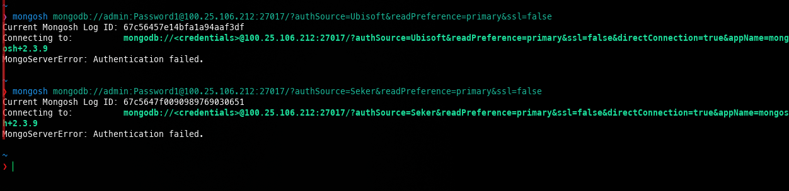

_Abbildung 1: Fehlgeschlagener Loginversuch_

**Skript zum erstellen der User:**

**Benutzer 1: Login und Interaktion:**

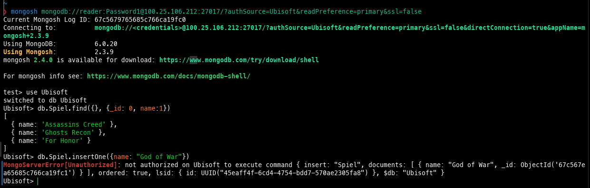

_Abbildung 2: Benutzer 1 Shell_

**Benutzer 2: Login und Interaktion:**

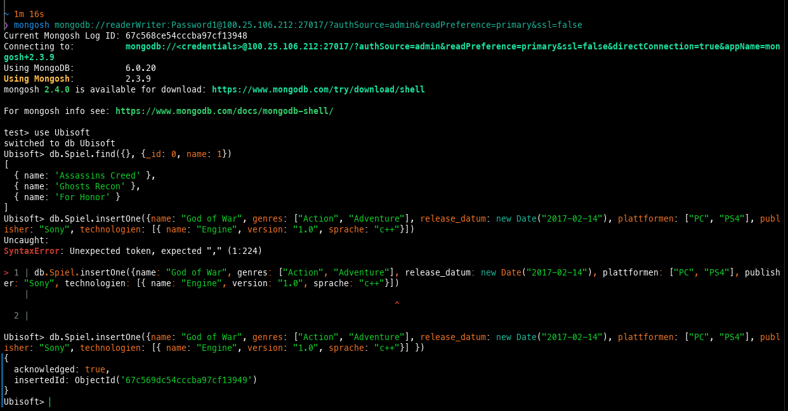

_Abbildung 3: Benutzer 2 Shell_

## B) Backup und Restore

### Variante 1: Snapshot

**Erstellung des Snapshots:**

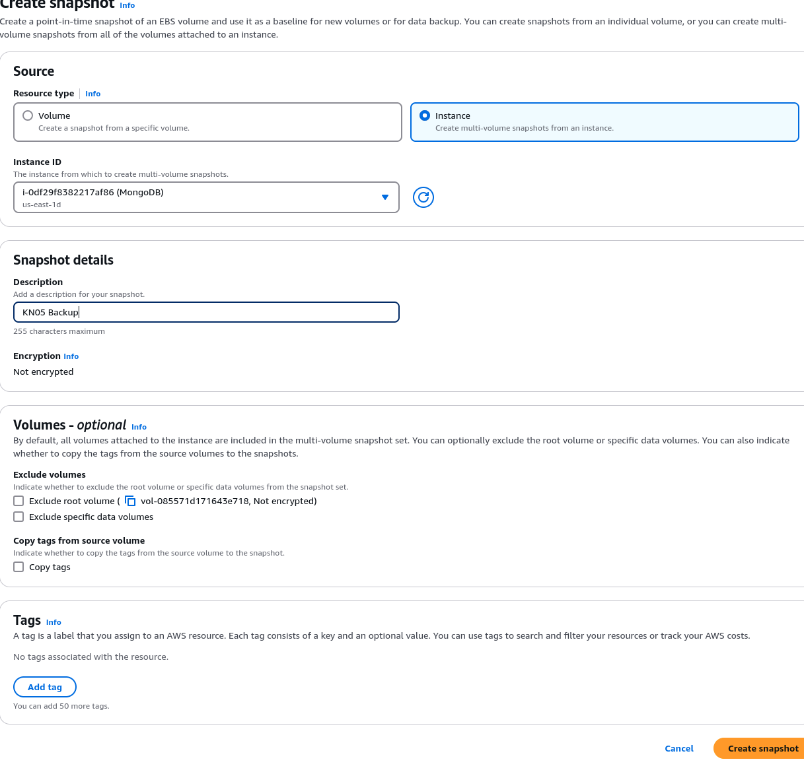

_Abbildung 4: Snapshot_

**Löschung einer Collection:**

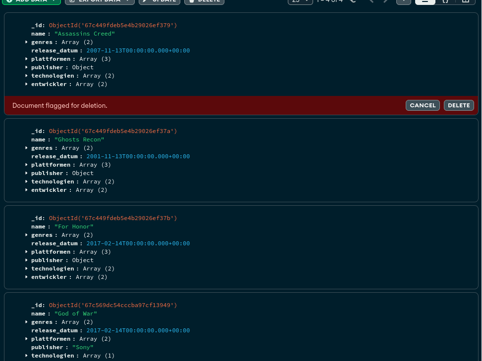

_Abbildung 5: Vor der Löschung_

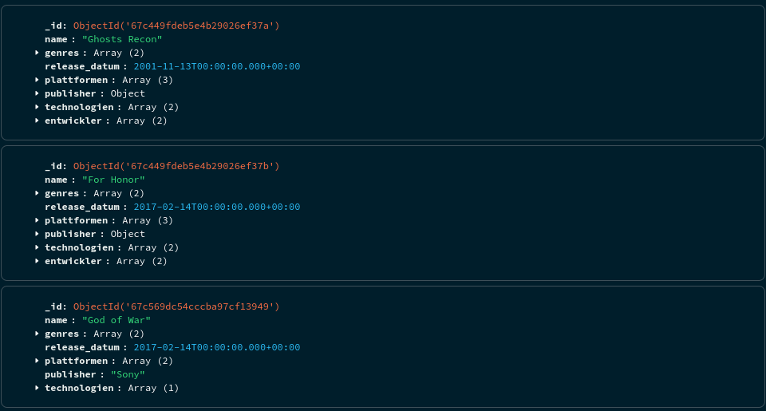

_Abbildung 6: Nach der Löschung_

**Wiederherstellung des Snapshots:**

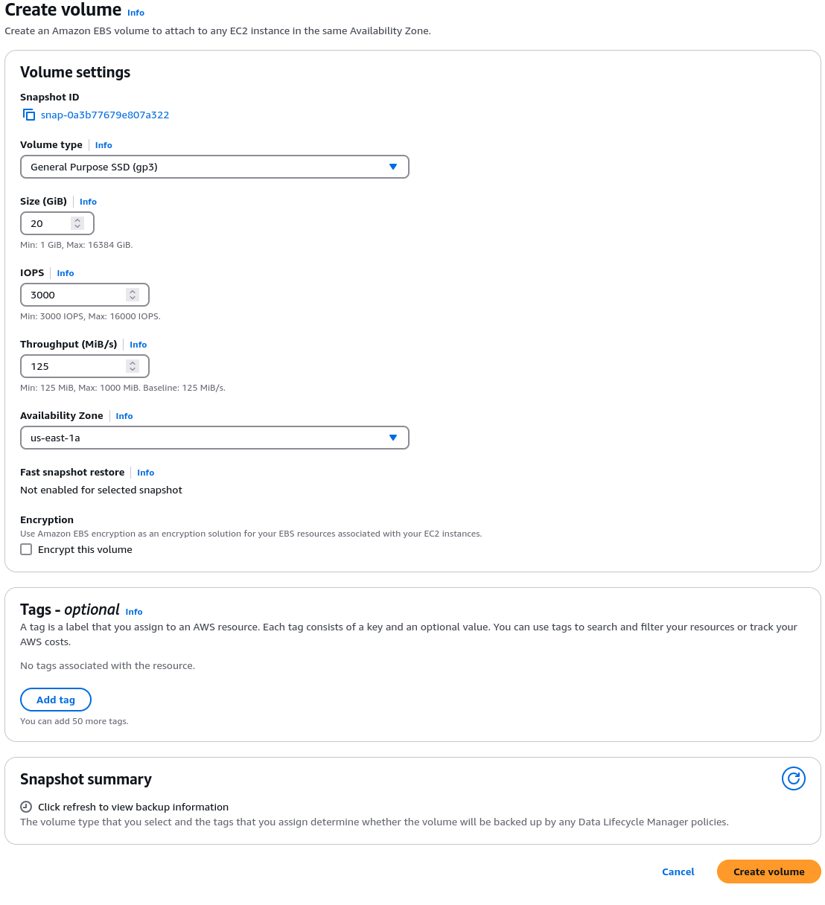

_Abbildung 7: Volume Creation_

**Detach des Volumes:**

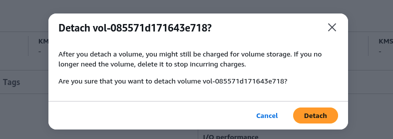

_Abbildung 8: Detach Volume_

**Attach des Volumes:**

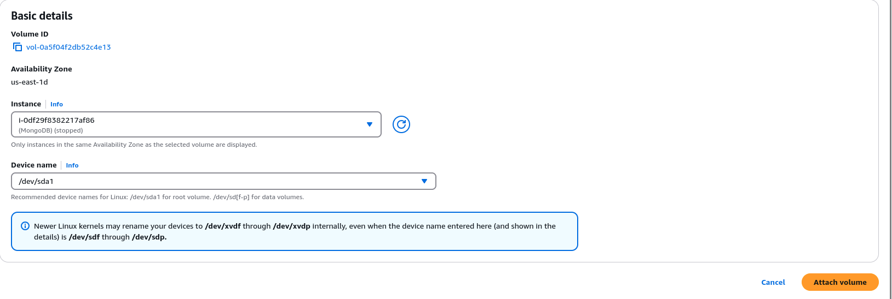

_Abbildung 8: Attach Volume_

**Ergebnis:**

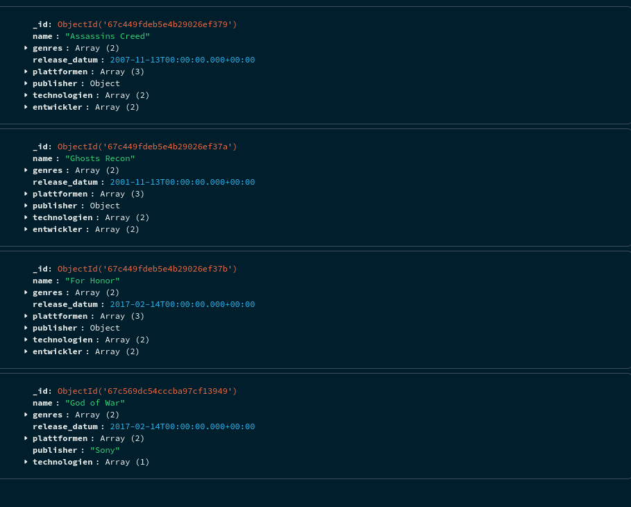

_Abbildung 9: Nach der Wiederherstellung_

### Variante 2: `mongodump`

**DB vor dem Löschen:**

_Abbildung 10: Collection vor dem Löschen_

**Erstellung des Dumps:**

**DB nach dem löschen:**

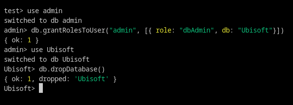

_Abbildung 11: Collection nach dem Löschen_

_Abbildung 12: Collection nach dem Löschen (GUI)_

**Wiederherstellung des Dumps:**

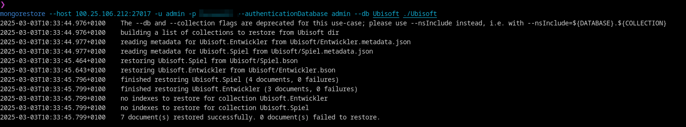

_Abbildung 13: Wiederherstellung des Dumps_

**Ergebnis:**

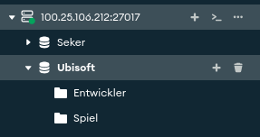

_Abbildung 14: Wiederherstellung des Dumps (GUI)_

## C) Skalierung

### Unterschied zwischen Replication und Partitioning

### Replication

**Replication** erstellt Kopien einer Datenbank oder einer Datenbank `node`. Jede `node` in einem Cluster erhält eine Kopie der Datenbank. Falls eine `node` ausfällt, kann eine andere `node` die Arbeit übernehmen. Es ist also eine Form von `scaling` und `fault tolerance`. Die Anfragen werden an die `nodes` verteilt. Während `Read Requests` verteilt werden, während `Write Requests` nur and die `Primary Node` gehen und diese dann an die `Secondary Nodes` weiterleitet.

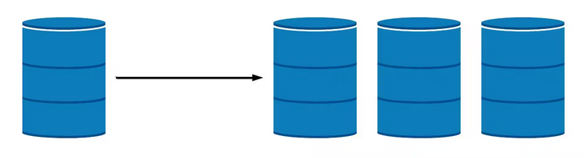

_Abbildung 15: Replication; Quelle: [MongoDB](https://www.mongodb.com/resources/basics/scaling)_

### Partitioning aka Sharding

**Partitioning** teilt die Datenbank in kleinere Teile auf. Jeder Teil wird auf einer anderen `node` gespeichert. Es ist also eine Form von `scaling`. Jedes `Replica Set` in einem Cluster speichert einen Teil der Daten, basierend auf einem `Shard Key`, welche evaluiert welche Daten auf welcher `node` gespeichert werden. Es ermöglicht die horizontale Skalierung von Datenbanken, virtuell ohne Limit. Weil jede `node` nur für einen Teil der Daten verantwortlich ist, wird die allgemeine Kapazität für `Read` und `Write` Anfragen erhöht.

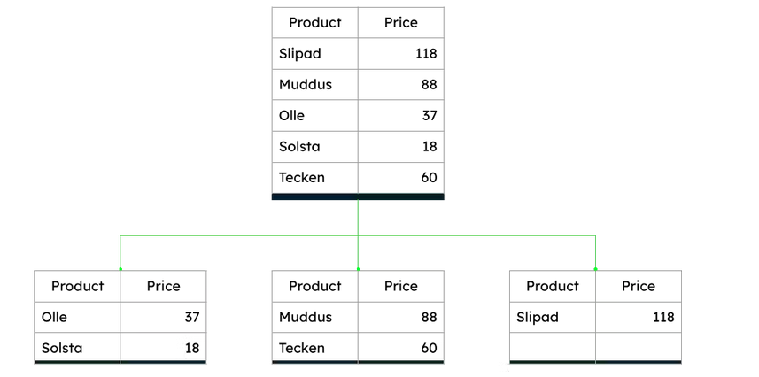

_Abbildung 16: Sharding; Quelle: [MongoDB](https://www.mongodb.com/resources/basics/scaling)_

Die Komplexität von `Sharding` ist höher als bei `Replication`. Weil jede `node` nur einen Teil der Daten speicher, müssen die Anfragen an die richtige `node` gesendet werden. Dies wird durch den `mongos` Prozess erledigt, welcher die Anfragen an die richtige `node` weiterleitet.

Wenn die Daten gleichmässig auf die `nodes` verteilt wird, können `reads` und `writes` parallel ausgeführt werden. Dies erhöht die Performance.

Nach allem was Sie nun wissen, machen Sie eine Empfehlung an Ihre Firma. Gehen Sie davon aus, dass eine der Applikationen Ihrer Firma MongoDB verwendet. Erklären Sie die Situation (textuell) und geben dann eine Empfehlung ab wie die Applikation weitergeführt werden soll. Ein Status Quo ist erlaubt als Empfehlung, muss aber begründet werden

### Empfehlung

Die Firma sollte `Sharding` verwenden, wenn die Datenbank zu gross wird. `Sharding` erlaubt die horizontale Skalierung der Datenbank, was bedeutet, dass die Datenbank auf mehrere `nodes` verteilt wird. Dies erhöht die Performance, weil `reads` und `writes` parallel ausgeführt werden können. Die Datenbank kann virtuell ohne Limit skaliert werden. Die Komplexität von `Sharding` ist höher als bei `Replication`, aber die Performance Vorteile sind es wert.
